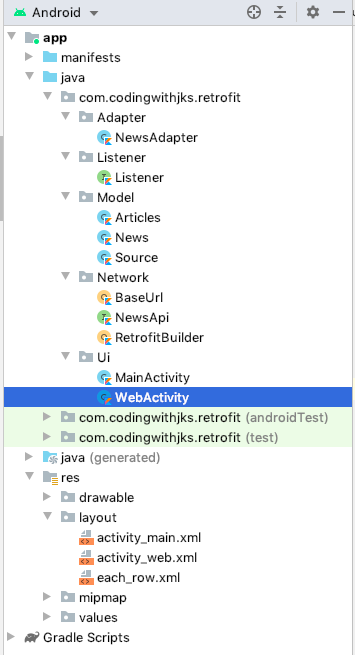

# News Feed App In Android Kotlin

This is a simple news feed application based on Retrofit and RecyclerView, The description of this project is first we will send a api request on the server for news json data , then shows into RecyclerView, after that whenever we click on any news item it will show the article on that news...

<h1 align="center">Project Structure</h1>

..........
..;;..
..........
